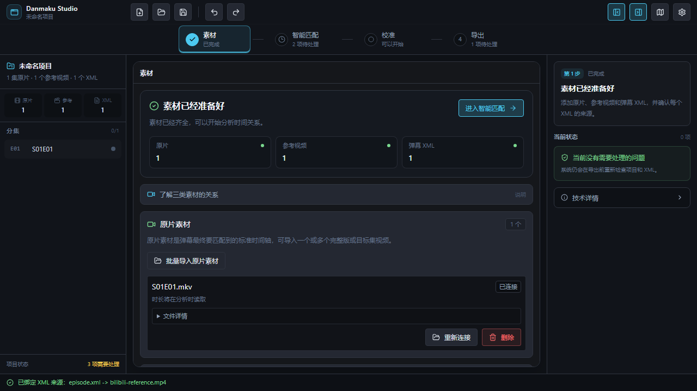
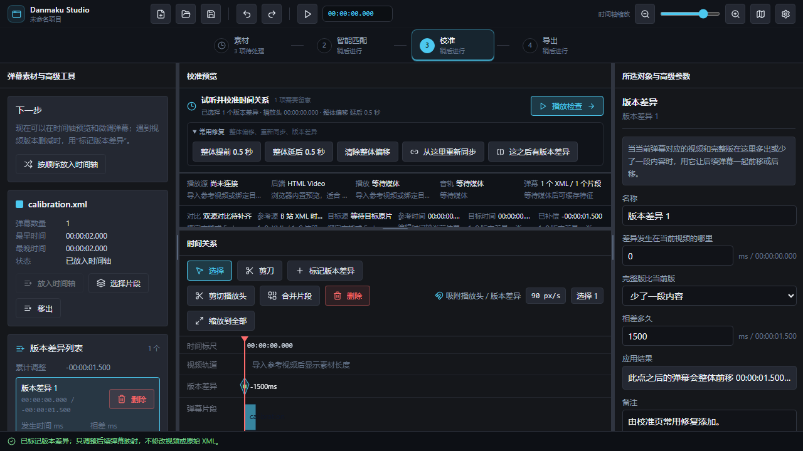

# Danmaku Studio

Danmaku Studio 是一款 Windows 桌面工具：把 B 站视频时间轴上的 XML 弹幕，校准到你真正观看的本地原片时间轴，并为每一集导出可交给外部弹幕播放器使用的新 XML。

它只处理弹幕和时间关系，不剪切、转码或修改视频；原始 XML 也不会被覆盖。



## 什么时候适合使用

你通常有三类文件：

- **原片**：最终要在 Emby、本地播放器或家庭影院中观看的高画质视频。
- **参考视频**：弹幕原本所对应的 B 站视频或其他参考版本。
- **弹幕 XML**：从 B 站获取的 XML 弹幕文件。

即使参考视频把多集连在一起、含片头片尾广告、被删减，或者与原片局部错位，Danmaku Studio 也能用时间映射和非破坏性规则描述这些差异，最后按原片分集导出 XML。

> 自动匹配会帮助定位对应关系，但不会把尚未证明可靠的结果伪装成准确。界面显示“需要复核”时，请试听或校准被标记的位置。

## 安装

1. 在 Windows 10 或 Windows 11 上运行 `Danmaku Timeline Studio_0.1.0_x64-setup.exe`。
2. 按安装向导完成安装并启动 Danmaku Studio。
3. 首次安装的未签名开发版可能触发 Windows SmartScreen；请确认安装包来源后再决定是否继续。

最终用户不需要安装 Node.js、Rust 或开发工具。当前安装包位置和开发者打包说明见 [打包说明](docs/PACKAGING.md)。

## 四步完成一次任务

### 1. 素材

分别把文件放到三个区域：

1. 批量导入一集或多集**原片素材**。
2. 导入一个或多个**参考视频**。
3. 导入**弹幕 XML**，并为每个 XML 选择它对应的参考视频。

页面顶部会告诉你还缺什么。三类素材准备好后，点击“进入智能匹配”。

### 2. 智能匹配

选择要分析的参考视频和原片，运行匹配。应用会把结果分为：

- 已匹配：时间关系完整，可以继续。
- 需要复核：存在多个可能位置、版本差异或证据不足。
- 无法判断：当前素材或工具不足，不能安全确认。

普通项目只需处理被标记的结果。参数、诊断和验收工具放在折叠区，不影响日常使用。

### 3. 校准

播放预览并观察弹幕是否与画面一致。常见修复可以直接用自然语言操作：

- 整体提前或延后 0.5 秒。
- 从当前播放位置重新同步。
- 标记“这之后有版本差异”并填写相差秒数。

所有修改都保存为可撤销的规则。原始 XML、参考视频和原片不会改变。



### 4. 导出

先处理“导出前检查”中的阻断项，再确认每集文件名和弹幕数量。正式分集导出会：

- 再次核对参考视频与原片的文件身份；
- 确认项目没有在检查期间发生变化；
- 生成后重新解析 XML，验证通过才写入磁盘；
- 显示真实输出路径，并提供“打开导出目录”和“再次导出”。

正式分集导出需要桌面版，并在“设置 → 导出”中选择默认导出文件夹。旧单集项目的兼容方式位于“兼容导出方式（单集或旧项目）”折叠区。

## 保存项目

点击顶部保存按钮会得到 `.danmaku-project.json`。项目文件保存媒体引用、弹幕数据和编辑规则，不嵌入视频。

把项目移动到另一台电脑后，应用可能要求重新选择原 XML、视频或重新完成受信复核；这是为了避免把不同文件误认为原素材。

## 使用前需要知道

- HTML 预览最适合 MP4/WebM。预览 MKV 等格式时，可在设置中配置 mpv。
- 自动媒体匹配需要可用的 FFmpeg/FFprobe；应用会检测工具，也可在设置中指定真实可执行文件。
- 当前版本不会承诺尚未经过授权真实样本证明的固定准确率。导出安全门和人工复核不能替代对最终观感的检查。
- 视频和 XML 由用户主动导入；项目不会自动上传本地媒体。

## 遇到问题

先查看 [故障排查](docs/TROUBLESHOOTING.md)。完整教程、隐私边界和开发资料可从 [文档导航](docs/README.md) 进入。

## 开发

```powershell
corepack pnpm install
corepack pnpm dev
corepack pnpm verify
corepack pnpm verify:release
```

开发环境、Git 回退和记录规则见 [开发与恢复](docs/DEVELOPMENT.md)，系统边界见 [架构说明](docs/ARCHITECTURE.md)。

## 许可

本项目采用 [GNU Affero General Public License v3.0](LICENSE)。
